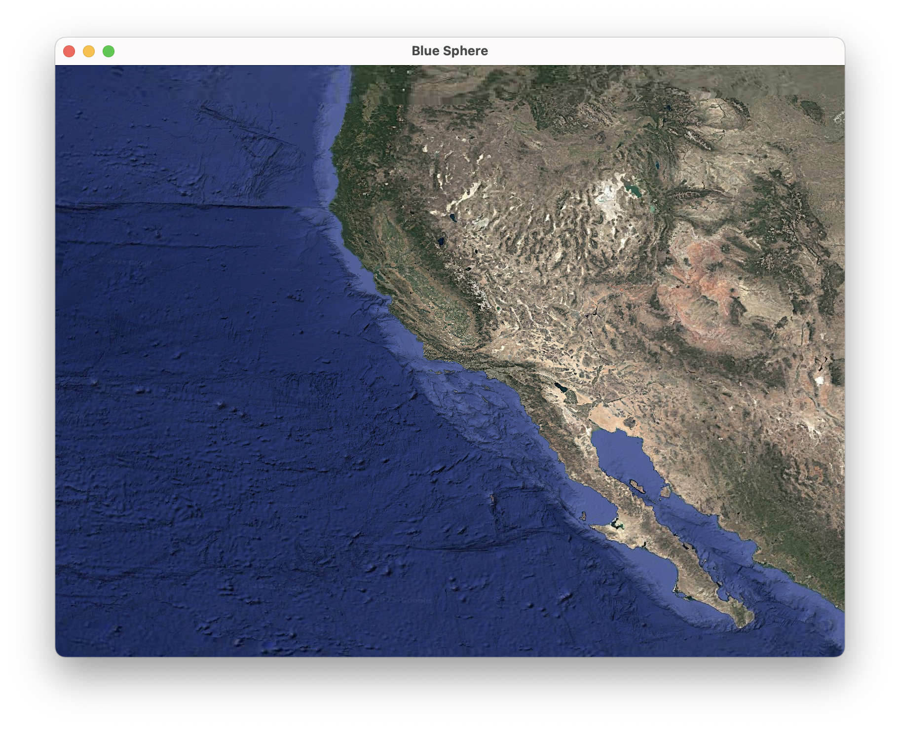
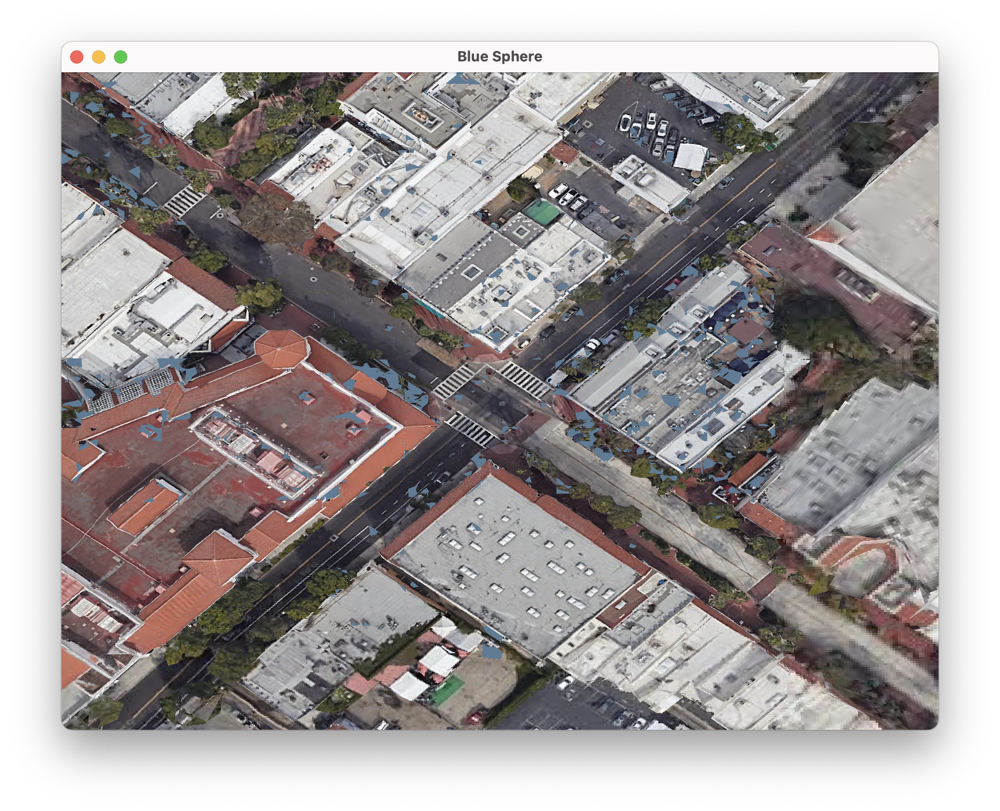

# A Better World 🌍

An experimental globe renderer and planetary visualization engine built in Rust using WGPU.

---

## 🖼️ Screenshots


_Global overview from space._


_Zoomed in at ground level._

---

## 🚀 Getting Started

Clone the repository and build the project in release or debug mode:

```bash
git clone https://github.com/your-username/abetterworld.git
cd abetterworld

# Build library
cargo build -p abetterworld
cargo build -p abetterworld --release

# Run sample desktop app (mac, windows, linux)
cargo run -p desktop

# Run sample web app
make build-web
make run-web

#ios & android TODO

# Run Unit Tests on Desktop
cargo test -p abetterworld

# Run Unit Tests on Web
make test-web

```

---

## 📱🖥 Cross-Platform Support

`abetterworld` is designed with a cross-platform rendering core and aims to support:

| Platform                          | Status       | Notes                                                |
| --------------------------------- | ------------ | ---------------------------------------------------- |
| 🖥 Desktop (Windows, macOS, Linux) | ✅ Supported | Primary development target. Uses WGPU + winit.       |
| 🌐 Web (WASM)                     | ✅ Supported | WASM support via `wasm-bindgen` + `wgpu` + `winit`.  |
| 📱 Android                        | ✅ Supported | NDK + `wgpu` with minimal Android glue planned.      |
| 📱 iOS                            | ✅ Supported | Requires custom build setup and iOS surface support. |

The rendering backend is powered by [`wgpu`](https://github.com/gfx-rs/wgpu), making the engine portable to any platform with modern GPU APIs (Vulkan, Metal, D3D12, WebGPU).

---

## 🛠 Dependencies

- [`wgpu`](https://github.com/gfx-rs/wgpu)
- [`winit`](https://github.com/rust-windowing/winit)
- [`cgmath`](https://github.com/rustgd/cgmath)
- [`env_logger`](https://docs.rs/env_logger)

---

## 📄 License

MIT — see [LICENSE](LICENSE) for details.

---

## 💬 Feedback & Contributions

This project is in early development. Issues, feedback, and contributions are welcome!
